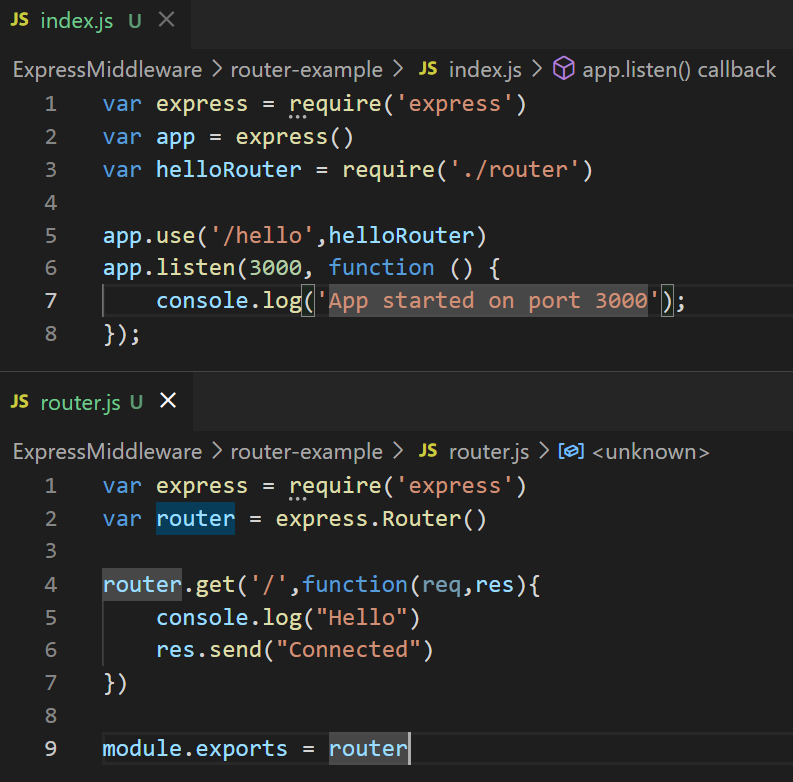

# Middleware

Middleware is a function that has access to the request object and the response object.


There are several types of middleware.

* Application-level middleware&#x20;
* Router-level middleware&#x20;
* Error-handling middleware
* Built-in middleware
* Third-party middleware


#### Application-level middleware&#x20;

application-level middleware binds with an instance of Express. In application-level middleware, we can use app.use() or app.get()... to handle different user's requests.&#x20;

```javascript
var express = require('express') => load express module
var app = express()  => create express instance

app.use(function (req, res, next){
    console.log("Application Middleware");
})
```

#### Router-level middleware

Router-level middleware binds with an instance of express.Router(). Router-level middleware allows us to create modular, mountable and more maintainable route handlers.



Route Parameters

:variable&#x20;

&#x20;
